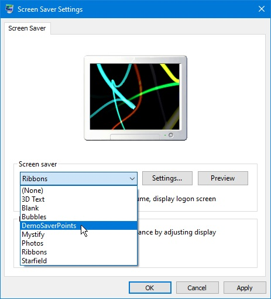
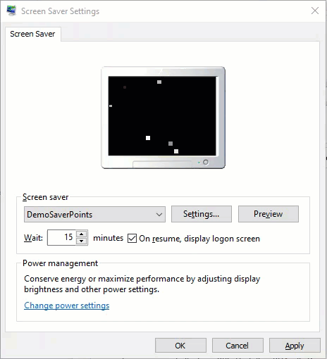

# WinScreenSaver
This repo can be used as a simple template app to create a Windows screensaver using C#, Windows Forms, and GDI+ for 2D graphics. The code was originally written around October 2012.

# Getting Started

The C# Windows solution should open and build with Visual Studio 2019 -- the most recent version used to test the code builds and runs.

Note: One may simply rename output *.exe to *.scr, and then place within the Windows system directory to be found by the OS Screen Saver Settings.

The main file to modify for drawing a custom screensaver is ScreenSaverVisualizer.cs. It inherits from a base class named ScreenSaverBase, which defines the following methods that must be implemented:

* void InitializeVisualizer() - Allow one-time initialization of screensaver state or display.
* void Draw( Graphics grfx ) - Called each time the screen will be redrawn on a fixed loop.
* void Update( float elapsed ) - Allows internal object state to be updated based on the provided ellapsed time.

By implementing those basic methods a simple animation using GDI+ for 2D drawing may be implemented.


(Example of simple particle effect screensaver included in default template.)


(The created executable will work with the Windows Screen Saver settings dialog.)



(The produced screensaver exe will also function in the Windows Screen Saver preview.)



```
Created by Taber
with a computer
```